=========================
Transitioning to Signals
=========================

Why all the emphasis on arrays?
================================

Arrays are a fundamental part of handling and manipulating signals and images in computational and data science contexts. Both **digital** signals and images can be represented as arrays of numerical data (**analog** can only be approximated), which can then be processed and analyzed using a variety of techniques.

1. **Signals**: Signals, such as audio signals, can be represented as one-dimensional arrays. In this context, each element in the array represents the amplitude of the signal at a given point in time. The sequence of these amplitudes over time forms the audio signal. This representation allows for digital signal processing techniques to be applied, such as filtering, Fourier transformation, or any other form of signal analysis.

2. **Images**: Images can be represented as multi-dimensional arrays (typically two or three dimensions). In a grayscale image, a two-dimensional array can be used where each element represents the intensity of a pixel in the image. For color images, usually a three-dimensional array is used. The first two dimensions represent the x and y coordinates of a pixel, and the third dimension represents the red, green, and blue (RGB) color channels. Each element in this array is again a numerical value representing the intensity of the corresponding color channel at a given pixel, i.e. an 8-bit grayscale image would be a 2D array of values ranging 0-255 ($2^8-1$).

By representing signals and images as arrays, powerful mathematical and computational operations can be applied to them. This includes convolution for image filtering, Fourier transforms for frequency analysis of signals, or linear algebra operations for image transformations. It also opens the possibility for machine learning algorithms to learn from these arrays of data, which has led to advances in areas such as speech recognition, image recognition, and more.

Signal processing involves various operations such as filtering, convolution, Fourier transformation, and sampling. Here, we'll cover some basic operations using NumPy:

Basic Signal Processing in Python/NumPy
========================================

.. code-block:: python

    import numpy as np

Generating a Simple Signal
----------------------------

A simple signal could be a sine wave. To generate a sine wave:

.. code-block:: python

    import numpy as np
    import matplotlib.pyplot as plt

    # Time variable
    t = np.linspace(0, 1, 500, endpoint=False)

    # A 5 Hz waveform
    a = np.cos(2 * np.pi * 5 * t)

    plt.plot(t, a)
    plt.show()

What's this other import ``matplotlib.pyplot``?
Matplotlib is a popular data visualization library in Python that allows users to create a wide range of high-quality plots, charts, and graphs. It provides a comprehensive set of tools for creating static, animated, and interactive visualizations.  With Matplotlib, users can generate line plots, scatter plots, bar charts, histograms, pie charts, and many other types of visual representations. It offers precise control over every aspect of a plot, including the axes, labels, colors, markers, and styles, allowing users to customize their visualizations to suit their needs.  Matplotlib is widely used in various fields such as data analysis, scientific research, engineering, finance, and more. It integrates well with other libraries and frameworks in the Python ecosystem, making it a versatile tool for data exploration and presentation.  In addition to its core functionality, Matplotlib also provides support for creating interactive plots using widgets and event handling, saving plots in different file formats, and incorporating mathematical expressions and LaTeX typesetting.

In this code, we generate a time variable ``t``, and a signal ``a`` that is a 5Hz sine wave. Then we plot the signal using ``matplotlib``.

.. image:: media/cosine_wave.png

Adding Noise to the Signal
------------------------------

Real-world signals often come with noise. Let's add some random noise, :math:`n\sim \mathcal{N}(\textbf{0},\sigma^2\textbf{I})`, where :math:`n` is a Gaussian random vector with mean :math:`\textbf{0} = [0,\dots,0]` and covariance matrix :math:`\sigma^2\mathbf{I}`, where :math:`\textbf{I}` is the identity matrix:

.. code-block:: python

    import numpy as np
    import matplotlib.pyplot as plt

    # Time variable
    t = np.linspace(0, 1, 500, endpoint=False)

    # A 5 Hz waveform
    a = np.cos(2 * np.pi * 5 * t)

    n = np.random.normal(0, 0.5, a.shape)
    a = a + n

    plt.plot(t, a)
    plt.show()

In this code, we generate random noise with the same shape as our signal, then add this noise to the original signal `a`.

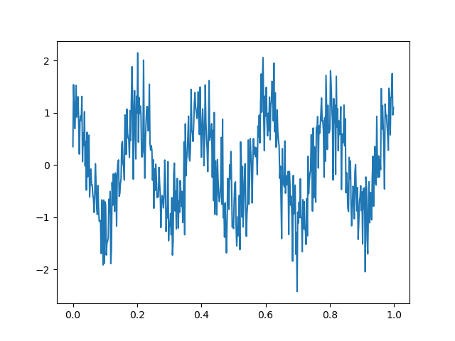


# Spectral Domain vs. Time Domain and a better waveform model
Let's start with an analogy. Imagine you are listening to a symphony orchestra playing a piece of music. All the different instruments playing together create a rich, complex sound that changes over time. This is similar to a signal in the time domain.

**Time Domain:** The time domain is a representation of a signal (like the music from the orchestra) that shows how the signal changes over time. When you plot the signal in the time domain, you can see the amplitude (how loud the orchestra is playing) at each point in time. However, in this representation, it's very hard to distinguish between the sounds made by different instruments. 

Now, imagine you have a magical pair of glasses. When you put on these glasses while listening to the orchestra, instead of hearing all the sounds mixed together, you start to hear each instrument separately. The violin, the trumpet, the drums, all become individually distinguishable. This is similar to a signal in the frequency (or spectral) domain.

**Frequency (Spectral) Domain:** The frequency domain is a representation of a signal that shows the different frequencies (like the individual notes played by different instruments) that make up the overall signal. When you plot the signal in the frequency domain, you can see the amplitude (how loud each instrument is playing) for each frequency (each instrument's note). This representation is very useful when you want to analyze the signal in terms of its constituent frequencies.

In summary:

- The time domain representation of a signal shows how the signal changes over time. 
- The frequency domain representation of a signal shows the constituent frequencies of the signal.

In signal processing, we often convert signals from the time domain to the frequency domain (and vice versa) because certain types of analysis and processing are easier to perform in the frequency domain. This transformation is typically done using a mathematical technique called the Fourier transform.

## Fourier Transform

Fourier transform is a way to transform a signal from time domain to frequency domain (roughly speaking). We can use the ``np.fft.fft`` function to compute the one-dimensional n-point discrete Fourier Transform (DFT).  We use ``np.abs`` to compute the absolute value of each element in the array to get what is called the magnitude response of the spectrum:

.. code-block:: python

    import numpy as np


    # Time variable
    t = np.linspace(0, 1, 500, endpoint=False)

    # A 5 Hz waveform
    a = np.cos(2 * np.pi * 5 * t)

    #Add Noise
    n = np.random.normal(0, 0.5, a.shape)
    a = a + n

    A = np.fft.fft(a)

In this code, we apply the Fourier transform to our noisy signal, but how would we visualize this and identify the frequencies?  For this we must incorporate the sampling rate.  At the end of the day, were working with digital signals, therefore it is more accurate to use a waveform model 

Also... let's start using values/units closer to reality.  The RF spectrum we work with generally ranges from VHF through Ka Band (30 MHz to 40 GHz).

.. code-block:: python

    import numpy as np
    import matplotlib.pyplot as plt
    plt.close('all')

    fc = 100e6 #Center frequency, 100 MHz
    Fs = 1e9 #Sampling frequency, 1 GHz (1 GSps)

    sample_num = np.arange(500) #Index tracking sample number np.arange gives a range of values [0,1,2,...,499] (increments by 1 by default)

    a = np.cos(2* np.pi * fc * sample_num/Fs)

    fig,axes = plt.subplots(1,2)
    axes[0].plot(sample_num[0:40]/Fs,a[0:40],marker = '.',alpha = .3)
    axes[0].set_xlabel('time (seconds)')

    #Add Noise
    n = np.random.normal(0, 0.5, a.shape)
    a = a + n

    A = np.fft.fft(a)
    A = np.fft.fftshift(A)
    #f = np.linspace(0,Fs,len(A))
    f = np.linspace(-Fs/2,Fs/2,len(A))


    axes[1].plot(f/1e6,np.abs(A)) #Magnitude 
    axes[1].plot(f/1e6,np.angle(A)) #Phase
    axes[1].set_xlabel('frequency (MHz)')

.. image:: media/time_freq.png

The key to mapping frequency from sample rate in the x-axis tick marks for the spectrum is ``f = np.linspace(-Fs/2,Fs/2,len(A))``.  Remember the FFT utilizes provides the normalized frequency spectrum between :math:`0` and :math:`2\pi`, but often a centered spectrum is easier to analyze, hence we use ``A = np.fft.fftshift(A)``.  **CAUTION** do not use ```fftshift``` in combination with computations involving the FFT, it will be incorrect.


Simulation vs. Reality
~~~~~~~~~~~~~~~~~~~~~~~~~~~~

Let's take a moment to elaborate on what was generated, a cosine (or sine) wave consists of a single frequency, therefore in the frequency domain we expect a single point whose peak is proportional to the signal power.  The reason for the two lines here is that the real-valued component (in this case the signal is all-real) has a symmetry about the y-axis (a negative frequency).  This negative frequency, while purely theoretical, must be incorporated in our models for real-life applications where issues with unwanted images get included.

Signal Filtering
=================

Filtering is a method to remove certain ranges of frequencies. For example, we could use a simple mean filter (also known as a moving average filter) to smooth our signal, $\textbf{y} = \textbf{a} * \textbf{h}$:

.. code-block:: python

    import numpy as np

    # Time variable
    t = np.linspace(0, 1, 500, endpoint=False)

    # A 5 Hz waveform
    a = np.cos(2 * np.pi * 5 * t)

    #Add Noise
    n = np.random.normal(0, 0.5, a.shape)
    a = a + n

    window_size = 10
    h = np.ones(window_size) / window_size

    # convolve the input signal with the filter kernel
    y = np.convolve(a, h, mode='same')

    plt.plot(t, y)
    plt.show()

This applies a moving average filter to our noisy signal and plots the smoothed signal.  Convolution is an operation found in various areas of, refer to [1,2] for more details on the discrete time (vector) implementation.

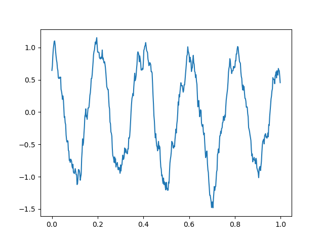

Remember, this is a very basic introduction. For more sophisticated signal processing tasks, you might want to look at the SciPy library, which provides more specific signal processing functionality. For complex filters, you would use convolution in the frequency domain, or use libraries such as SciPy's `signal` module, which provide ready-to-use filter design and application functions.

Generate noisy sine waves with a frequency of 200 MHz and 1200 MHz (1.2 GHz) and then apply a low-pass Butterworth filter to it with a cut-off frequency of 500 MHz.

.. code-block:: python

    import numpy as np
    import matplotlib.pyplot as plt
    from scipy.signal import butter, lfilter, freqz
    plt.close('all')

    fft = np.fft.fft
    def ffts(x): return np.fft.fftshift(fft(x))

    # Generate a noisy sine wave
    fc1 = 200e6 #Center frequency, 200 MHz
    fc2 = 1200e6 #Center frequency, 300 MHz
    Fs = 10e9 #Sampling frequency, 10 GHz (10 GSps)

    sigma = 2 #Noise standard deviation


    y1 = np.sin(2*np.pi * fc1 * np.arange(500)/Fs)
    y2 = np.sin(2*np.pi * fc2 * np.arange(500)/Fs)

    y = y1 + y2 + sigma * np.random.randn(len(y1))
    Ys = ffts(y)

    # Design the Butterworth filter
    cutoff = 500e6
    b, a = butter(4, Wn = cutoff, btype='low', fs = Fs, analog=False)

    #Determine frequency response
    w, h = freqz(b,a, worN = int(len(Ys)), whole = True)
    H = np.fft.fftshift(h)
    # H = np.hstack([np.conj(h[-1:1:-1]),h])

    # Apply the filter
    y_filtered = lfilter(b, a, y)
    Ys_filtered = ffts(y_filtered)

    f = np.linspace(-Fs/2,Fs/2,len(Ys))
    fig,axes = plt.subplots(2,1,sharex = True)
    axes[0].plot(f/1e6,np.abs(Ys))
    axes[0].set_ylim([0,300])

    axes[1].plot(f/1e6,np.abs(Ys_filtered))
    axes[1].set_ylim([0,300])
    axes[1].set_xlabel('frequency (MHz)')

    fig1,axes1 = plt.subplots(2,1)
    axes1[0].plot(f/1e6, np.abs(H))
    axes1[1].plot(f/1e6, np.angle(H))
    axes1[1].set_xlabel('frequency (MHz)')
    plt.show()


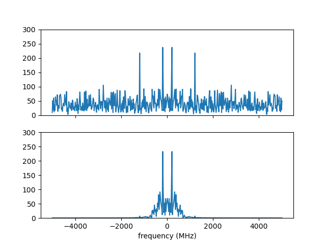

Note in the figure on the bottom that the higher frequency sine wave has been removed.  Here is a look at the frequency response of the filter to provide some more insight.  The top plot shows the magnitude response, which we see that outside our cutoff (or stopband) frequency, 500 MHz, is significantly lower.  The phase response on the bottom, while it may not appear to yield much insight at first, shows that inside the $\pm$ 500 MHz (or the passband) that the phase is "linear".  It is typical in good filter design to produce linear or near-linear phase so that the distortions accumulated while filtering are predictable, i.e. group delay.  Most signal processing texts will go into more detail, see [1,2,3].

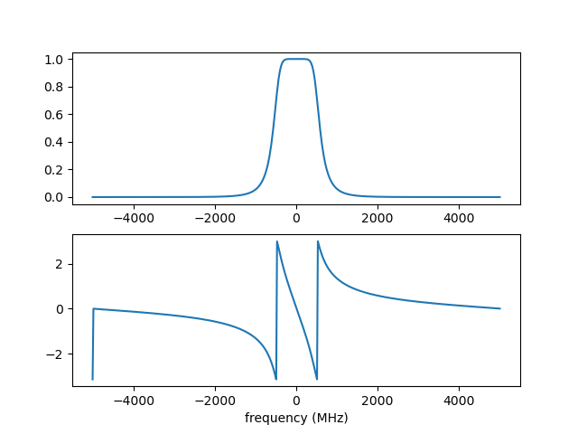


Multi-Rate Signal Processing
===============================

Imagine you're at a sports game and you want to capture the most crucial moments, both as photographs and videos. 

1. **Photographs (Lower Rate):** You snap a few photos occasionally — maybe one every few minutes. This is analogous to "down-sampling" or "decimation" in multi-rate signal processing. You're capturing fewer frames over a certain period, thereby reducing the "data rate."

2. **Videos (Higher Rate):** Now, when there's a crucial play, you switch to recording a video at 60 frames per second. Here, you're capturing a lot of frames in a short amount of time. This is similar to "up-sampling" or "interpolation," where you increase the data rate.

In the world of digital signal processing, "sampling" is like taking these photos or videos. It's how we convert real-world signals (like sound or radio waves) into digital data that computers and electronics can understand.  Just like in our sports game scenario, sometimes we want to process some parts of a signal at a higher "frame rate" (or data rate) because there's more happening there. Other times, when there's less happening, we might choose a lower rate to save on data and processing power. 

**Why Do We Do Multi-Rate Signal Processing?**

1. **Efficiency:** By processing signals at rates that match their content, we can save computational resources, storage, and bandwidth.
 
2. **Flexibility:** Multi-rate processing allows us to design systems that can adapt to different situations. Think of a music streaming service that switches to a lower quality (rate) when your internet connection is weak and a higher quality when it's strong.

3. **Quality:** Sometimes, to achieve certain results (like filtering out noise or other unwanted parts of a signal), it's beneficial to first increase the rate of the signal, process it, and then bring it back down.

In Summary:

Multi-rate digital signal processing is like having a camera that can switch between taking occasional photos and shooting high-frame-rate videos, depending on what's happening. It's about adapting the "rate" of processing to best match the signal's content or the system's requirements, leading to more efficient and flexible systems. Refer to [3] for more details.

Decimation (Downsampling)
----------------------------

.. code-block:: python

    import numpy as np
    import matplotlib.pyplot as plt
    from scipy.signal import butter, lfilter, freqz
    plt.close('all')

    fft = np.fft.fft
    def ffts(x): return np.fft.fftshift(fft(x))

    # Generate a noisy sine wave
    fc1 = 200e6 #Center frequency, 200 MHz
    fc2 = 1200e6 #Center frequency, 300 MHz
    Fs = 10e9 #Sampling frequency, 10 GHz (10 GSps)
    ds_fac = 10 #Decimation (Downsample) factor
    Fs_dec = int(Fs/10)


    y1 = np.sin(2*np.pi * fc1 * np.arange(500)/Fs)
    y2 = np.sin(2*np.pi * fc2 * np.arange(500)/Fs)

    y = y1 + y2

    # Design the Butterworth filter
    cutoff = 500e6
    b, a = butter(4, Wn = cutoff, btype='low', fs = Fs, analog=False)

    y1_dec = y1[::ds_fac]
    y_dec = y[::ds_fac]
    y_filtered = lfilter(b, a, y)
    y_filtered_dec = y_filtered[::ds_fac]


    fig,axes = plt.subplots()
    axes.plot(y1_dec)
    axes.plot(y_dec)
    axes.plot(y_filtered_dec)
    axes.legend(['Original','Decimated','Filtered, then Decimated'])
    axes.set_ylim([-3,3])
    axes.set_xlabel('sample')
    plt.show()


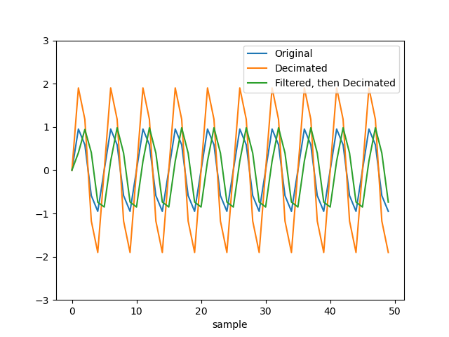

Interpolation (Upsampling)
------------------------------

More than just inserting zeros...

Imagine you are looking at a connect-the-dots puzzle, but some of the dots are missing. You can still visualize the shape or picture by drawing straight lines between the dots you can see, even if there are gaps.  Interpolation is like filling in those missing dots so that the picture is more complete and flows smoothly. Instead of having jagged straight lines, you can get a curve or a smoother line that makes more sense and provides a better idea of the whole picture.  For a simpler example, think about the temperature readings at noon over a week. If you only have readings for Monday, Wednesday, and Friday, but you want to guess (or estimate) what the temperature was on Tuesday and Thursday, you could use the readings from the days you know to make a good guess. Interpolation is the mathematical way of making that guess.  In essence, interpolation is about using what you know to estimate what you don't know. It helps in filling gaps or making smoother transitions between known points or values.

.. code-block:: python

    import numpy as np
    import matplotlib.pyplot as plt
    plt.close('all')

    def linear_interpolation(x,upsample_factor):
        xnew = []
        for ii in np.arange(len(x)-1):
            x_new_ii = np.linspace(x[ii],x[ii+1],upsample_factor)
            xnew.extend(x_new_ii)
        return xnew


    x = [1,4,5,3,1,10]
    t = np.arange(len(x))
    upsample_factor = 10

    xnew = linear_interpolation(x, upsample_factor)
    tnew = linear_interpolation(t,upsample_factor)
    fig,axes = plt.subplots()

    axes.plot(tnew,xnew)
    axes.plot(t,x,'.')
    axes.legend(['Interpolated Signal','Original Samples'])

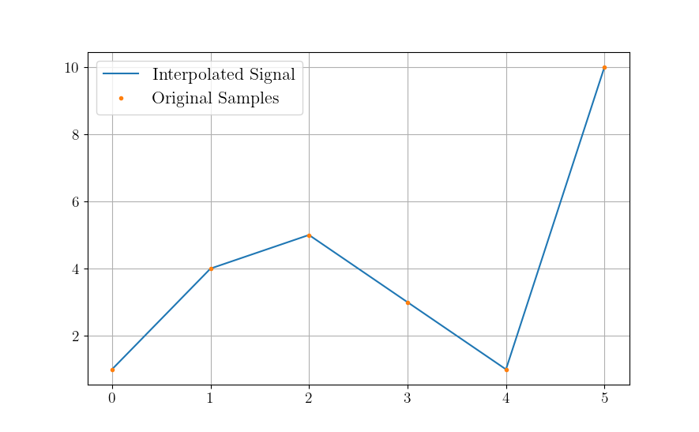


The Nyquist-Shannon sampling theorem provides a prescription for how to perfectly reconstruct a continuous-time signal from its samples, under certain conditions. Specifically, it states that a band-limited signal $x(t)$ that contains no frequency components higher than :math:`f_{\text{max}}` can be completely reconstructed from its samples if it is sampled at a rate :math:`f_s > 2 f_{\text{max}}`.

The formula for reconstruction is:


:math:`x(t) = \sum_{n=-\infty}^{\infty} x[n] \cdot \text{sinc}\left(\frac{t - nT}{T}\right)`


where :math:`x[n]` are the samples of the signal :math:`x(t)` taken at intervals :math:`T = 1/f_s`, and :math:`\text{sinc}(x) = \frac{\sin(\pi x)}{\pi x}`.

Here's a Python example that demonstrates the reconstruction of a signal using sinc functions. 

.. code-block:: python

    import numpy as np
    import matplotlib.pyplot as plt
    plt.close('all')
    # Define parameters
    fs = 500  # Sampling frequency in Hz
    T = 1/fs  # Sampling interval
    t = np.linspace(0, 1, fs)  # Time vector from 0 to 1 second

    # Create a sample signal: sum of two sine waves
    f1, f2 = 5, 50  # frequencies of the sine waves in Hz
    #x = np.sin(2 * np.pi * f1 * t) 
    x = np.sin(2 * np.pi * f2 * t)

    # Plot original signal
    plt.figure()
    plt.subplot(2, 1, 1)
    plt.title('Samples')
    plt.plot(x,'.')
    plt.xlabel('n')
    plt.ylabel('Amplitude')

    # Now let's reconstruct the signal from its samples
    reconstructed_signal = np.zeros_like(t)

    # We only consider a finite number of samples for the reconstruction for demonstration purposes.
    for n in range(len(x)):
        sinc = np.sinc((t - n * T) / T)  # sinc function centered at nT
        reconstructed_signal += x[n] * sinc

    # Plot reconstructed signal
    plt.subplot(2, 1, 2)
    plt.title('Reconstructed Signal')
    plt.plot(t, reconstructed_signal)
    plt.xlabel('Time [s]')
    plt.ylabel('Amplitude')

    plt.tight_layout()
    plt.show()

This code snippet creates a sample signal that is a sine wave at 50 Hz. It then reconstructs the signal from its samples using sinc functions, following the Nyquist-Shannon sampling theorem.

Remember that in this example we consider a finite number of samples for reconstruction. In the ideal mathematical model, the reconstruction sum goes from :math:` -\infty` to :math:`\infty`, but this is not possible to implement on a computer. Nonetheless, even with the finite sum, you will see that the original and reconstructed signals closely match, illustrating the power of the theorem.

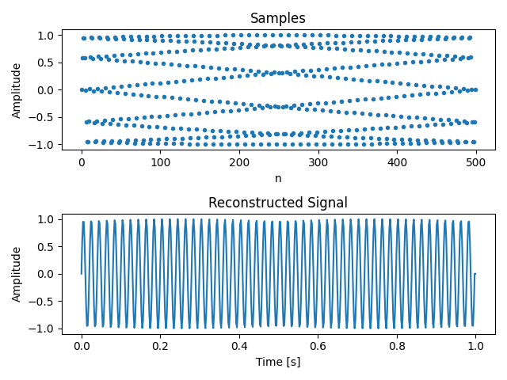


Center Frequency and Mixing 
============================

Frequency conversion and the use of intermediate frequency (IF) stages are fundamental concepts in radio and radar systems. These techniques are employed for several reasons, enhancing the performance, flexibility, and functionality of communication and sensing systems. Here's a detailed overview:

Reasons for Frequency Conversion
---------------------------------

**Improving Antenna Performance:**
- Antennas are typically more efficient when they are about half the wavelength of the transmitted or received signal. For high-frequency signals (like those in the GHz range), this would mean very small antennas. By converting to a lower IF, you can use a more efficiently sized antenna.

**Easing Filter Requirements:**
- Filtering high-frequency signals to remove unwanted components (like noise or adjacent channel signals) is challenging because it requires very sharp filters. It's easier and more cost-effective to filter at a lower IF.

**Enhancing Frequency Selectivity:**
- When signals are downconverted to IF, it's easier to achieve high selectivity (distinguishing the desired signal from nearby frequencies), as filter performance is generally better at lower frequencies.

**Facilitating Amplification:**
- Amplifying high-frequency signals without distortion is more challenging and expensive than amplifying lower-frequency signals. Downconversion allows for more effective and efficient amplification at IF.

**Allowing for Frequency Multiplexing:**
- Multiple signals can be upconverted to different carrier frequencies, combined, and transmitted simultaneously over a single channel (frequency multiplexing). At the receiver, they are then downconverted and separated, which is more manageable at IF.

### Use of Intermediate Frequency Stages:

**Improving Gain and Noise Performance:**
- By using multiple stages of IF, the system can achieve high gain more linearly and with better noise performance. This is crucial in both communication and radar systems for detecting weak signals.

**Simplifying Tuning:**
- In receivers, especially those with wide tuning ranges (like in a broadcast receiver), it's easier to implement the variable tuning at a fixed IF rather than at the variable incoming frequency.

**Enabling Complex Signal Processing:**
- Many advanced signal processing techniques (like certain types of demodulation or digital signal processing) are more effectively implemented at lower frequencies. Downconverting to IF facilitates this.

**Facilitating Doppler Processing in Radar Systems:**
- In radar, downconverting to IF allows for effective Doppler processing, which is used to measure the velocity of targets.

**Allowing for Better Integration and Miniaturization:**
- Modern electronic components (like integrated circuits) are better suited for lower-frequency operations. Using IF stages makes it easier to integrate and miniaturize the system.

In summary, frequency conversion and IF stages are critical in radio and radar technology, as they allow for more efficient antenna design, easier filtering and amplification, improved frequency selectivity, and effective implementation of advanced signal processing techniques. These techniques enable the practical realization of high-performance, versatile, and compact communication and sensing systems.

Let's take a look at some examples:

Center Frequency
--------------------
   - This is the frequency at the center of a bandwidth of interest in a signal. In radio communications, it refers to the frequency of a carrier wave.

.. code-block:: python

    import numpy as np
    import matplotlib.pyplot as plt

    # Carrier Signal
    fs = 1000  # Sampling frequency
    fc = 100   # Center frequency (carrier frequency)
    N = 100 
    t = np.arange(N)/fs
    carrier = np.cos(2 * np.pi * fc * t)

    plt.plot(t, carrier)
    plt.title("Carrier Signal at Center Frequency")
    plt.xlabel("Time (s)")
    plt.ylabel("Amplitude")
    plt.show()

Mixing a Signal with a Carrier
~~~~~~~~~~~~~~~~~~~~~~~~~~~~~~~~
   - Mixing involves combining two signals. In the context of radio communications, it typically refers to combining a baseband signal (like audio or data) with a carrier signal (a sinusoidal wave at a much higher frequency). This process is fundamental to modulating a signal for transmission.

Upconversion
------------------
   - Upconversion is the process of shifting a signal from a lower frequency (baseband) to a higher frequency. This is typically done for transmission purposes, where a low-frequency baseband signal is shifted to a high-frequency carrier.

.. code-block:: python

    import numpy as np
    import matplotlib.pyplot as plt

    # Carrier Signal
    fs = 1000  # Sampling frequency
    fc = 100   # Center frequency (carrier frequency)
    N = 500
    t = np.arange(N)/fs
    carrier = np.cos(2 * np.pi * fc * t)

    # Baseband Signal (On-Off Keying)
    num_chips = 20
    symbol_rate = 20/t[-1]
    data = np.random.choice([0, 1], size=num_chips)  # Random binary data
    baseband = np.repeat(data, int(N/num_chips))  # Repeat each bit for a duration

    # Mixing
    mixed_signal = baseband * carrier

    fig,ax = plt.subplots(3,1)
    ax[0].plot(t, carrier)
    ax[0].set_title("Carrier")
    ax[1].plot(t, baseband)
    ax[1].set_title('Baseband')
    ax[2].plot(t, mixed_signal)
    ax[2].set_title("Mixed Signal")
    ax[-1].set_xlabel("Time (s)")
    fig.text(0.04, 0.5, 'Amplitude', va='center', rotation='vertical',fontsize = 14)


    # Frequency Domain
    Carrier = np.fft.fftshift(np.fft.fft(carrier))
    Baseband = np.fft.fftshift(np.fft.fft(baseband))
    Mixed_signal = np.fft.fftshift(np.fft.fft(mixed_signal))

    f = np.linspace(-fs/2,fs/2,N)

    fig,ax = plt.subplots(3,1)
    ax[0].plot(f, np.abs(Carrier))
    ax[0].set_title("Carrier")
    ax[1].plot(f, np.abs(Baseband))
    ax[1].set_title('Baseband')
    ax[2].plot(f, np.abs(Mixed_signal))
    ax[2].set_title("Mixed Signal")
    ax[-1].set_xlabel("Frequency (Hz)")
    fig.text(0.04, 0.5, 'Magnitude', va='center', rotation='vertical',fontsize = 14)

    plt.show()

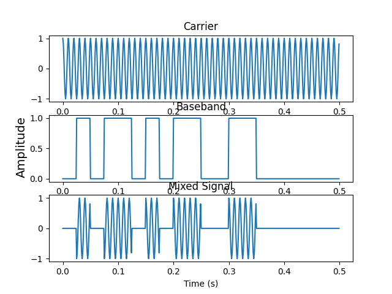

.. image:: media/ook_mixed_freq.png

Let's look at the frequency domain closer, in the mixed signal, note that there is an **image** in the "negative" frequencies.  While practically the concept of "negative frequency" isn't really a thing, this theoretical concept plays a role in practice.  Note that the carrier used was an all real signal, and that the spectrum of a real signal is always symmetric (if ```sine``` used, it's actually negative symmetric). One might try downconversion by simply upconverting the image.  Let's see what happens

Downconversion
------------------
   - Downconversion is the opposite of upconversion. It's the process of shifting a signal from a higher frequency to a lower frequency. This is usually done at the receiver end to convert the received high-frequency signal back to its original baseband form.
   
.. code-block:: python

    import numpy as np
    import matplotlib.pyplot as plt
    from scipy.signal import butter, lfilter, freqz

    # Carrier Signal
    fs = 1000  # Sampling frequency
    fc = 100   # Center frequency (carrier frequency)
    N = 500
    t = np.arange(N)/fs
    carrier = np.cos(2 * np.pi * fc * t)

    # Baseband Signal (On-Off Keying)
    num_chips = 20
    symbol_rate = num_chips/t[-1]
    data = np.random.choice([0, 1], size=num_chips)  # Random binary data
    baseband = np.repeat(data, int(N/num_chips))  # Repeat each bit for a duration

    # Design the Butterworth filter
    cutoff = 40
    b, a = butter(4, Wn = cutoff, btype='low', fs = fs, analog=False)

    # Mixing
    mixed_signal = baseband * carrier
    downconverted_signal = mixed_signal * carrier

    #Filtering
    downconverted_filtered_signal = lfilter(b, a, downconverted_signal)

    fig,ax = plt.subplots(3,1)
    ax[0].plot(t, baseband)
    ax[0].set_title('Original Signal')
    ax[1].plot(t, downconverted_signal)
    ax[1].set_title("Downconverted Signal")
    ax[2].plot(t, downconverted_filtered_signal)
    ax[2].set_title("Downconverted and Filtered Signal")
    ax[-1].set_xlabel("Time (s)")
    fig.text(0.04, 0.5, 'Amplitude', va='center', rotation='vertical',fontsize = 14)

    # Frequency Domain
    Baseband = np.fft.fftshift(np.fft.fft(baseband))
    Mixed_signal = np.fft.fftshift(np.fft.fft(mixed_signal))
    Downconverted_signal = np.fft.fftshift(np.fft.fft(downconverted_signal))
    Downconverted_filtered_signal = np.fft.fftshift(np.fft.fft(downconverted_filtered_signal))

    f = np.linspace(-fs/2,fs/2,N)

    fig,ax = plt.subplots(3,1)
    ax[0].plot(f, np.abs(Baseband))
    ax[0].set_title('Original Signal')
    ax[1].plot(f, np.abs(Downconverted_signal))
    ax[1].set_title("Downconverted Signal")
    ax[2].plot(f, Downconverted_filtered_signal)
    ax[2].set_title("Downconverted and Filtered Signal")
    ax[-1].set_xlabel("Frequency (Hz)")
    fig.text(0.04, 0.5, 'Magnitude', va='center', rotation='vertical',fontsize = 14)


    plt.show()

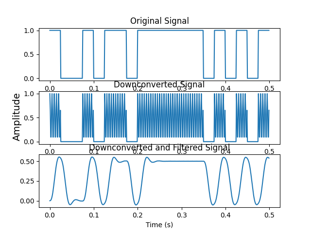


As you can see, downconversion alone is not sufficient without filtering.  The added high-frequency components added in the additional image can cause processing errors. Hence, we applied a low-pass filter and design our ``cutoff`` to be the frequency at which we are sending On-Off Keyed symbols (40 per second or 40 Hz).

Complex Carrier
-------------------

Often a real carrier is adopted for analog processes due to the need for two RF paths with complex-valued signal processing.  However, in the digital domain, it often makes more sense to work with complex values as follows.  We reuse our example, but use a complex exponential ``np.exp()`` instead.

.. code-block:: python

    import numpy as np
    import matplotlib.pyplot as plt
    from scipy.signal import butter, lfilter, freqz

    # Carrier Signal
    fs = 1000  # Sampling frequency
    fc = 100   # Center frequency (carrier frequency)
    N = 500
    t = np.arange(N)/fs
    carrier = np.exp(1j * 2 * np.pi * fc * t)

    # Baseband Signal (On-Off Keying)
    num_chips = 20
    symbol_rate = num_chips/t[-1]
    data = np.random.choice([0, 1], size=num_chips)  # Random binary data
    baseband = np.repeat(data, int(N/num_chips))  # Repeat each bit for a duration

    # Mixing
    mixed_signal = baseband * carrier
    downconverted_signal = mixed_signal * np.conj(carrier)


    fig,ax = plt.subplots(4,1)
    ax[0].plot(t, np.real(carrier))
    ax[0].plot(t, np.imag(carrier))
    ax[0].set_title("Carrier")
    ax[1].plot(t, np.real(baseband))
    ax[1].plot(t, np.imag(baseband))
    ax[1].set_title('Baseband')
    ax[2].plot(t, np.real(mixed_signal))
    ax[2].plot(t, np.imag(mixed_signal))
    ax[2].set_title("Mixed Signal")
    ax[3].plot(t, np.real(downconverted_signal))
    ax[3].plot(t, np.imag(downconverted_signal))
    ax[3].set_title("Downconverted Signal")
    ax[-1].set_xlabel("Time (s)")
    fig.text(0.04, 0.5, 'Amplitude', va='center', rotation='vertical',fontsize = 14)


    # Frequency Domain
    Carrier = np.fft.fftshift(np.fft.fft(carrier))
    Baseband = np.fft.fftshift(np.fft.fft(baseband))
    Mixed_signal = np.fft.fftshift(np.fft.fft(mixed_signal))
    Downconverted_signal = np.fft.fftshift(np.fft.fft(downconverted_signal))

    f = np.linspace(-fs/2,fs/2,N)

    fig,ax = plt.subplots(4,1)
    ax[0].plot(f, np.abs(Carrier))
    ax[0].set_title("Carrier")
    ax[1].plot(f, np.abs(Baseband))
    ax[1].set_title('Baseband')
    ax[2].plot(f, np.abs(Mixed_signal))
    ax[2].set_title("Mixed Signal")
    ax[3].plot(f, np.abs(Downconverted_signal))
    ax[3].set_title("Downconverted Signal")
    ax[-1].set_xlabel("Frequency (Hz)")
    fig.text(0.04, 0.5, 'Magnitude', va='center', rotation='vertical',fontsize = 14)


    plt.show()

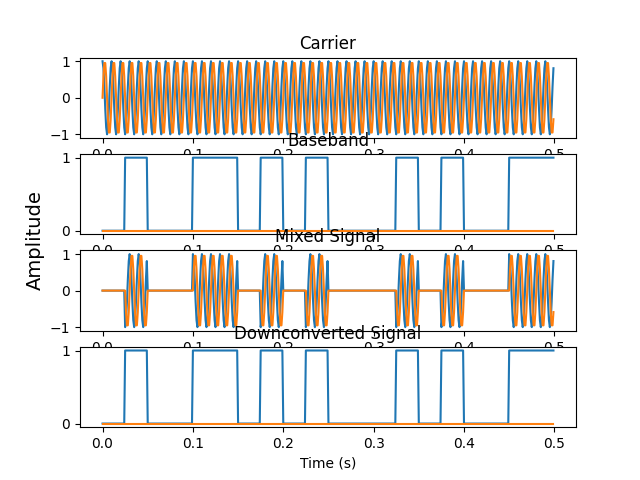

.. image:: media/ook_complex_freq.png

There you have it, no filtering needed, you just need a conjugate (negative imaginary part) for downconversion of the carrier used previously for upconversion.  

You will see some more use of complex-valued signals in the next lab.  


References and Further Reading

[1] Alan V. Oppenheim and Ronald W. Schafer. 2009. Discrete-Time Signal Processing (3rd. ed.). Prentice Hall Press, USA.

[2] John G. Proakis and Dimitris G. Manolakis. 1996. Digital signal processing (3rd ed.): principles, algorithms, and applications. Prentice-Hall, Inc., USA.

[3] Harris, Fredric J. Multirate signal processing for communication systems. CRC Press, 2022.


Project
===========

Problem 1: Efficient Filtering
--------------------------------

The ``lfilter`` function applies the convolution in the time domain, which is colloquially known as linear filtering, but is actually inefficient compared to other methods.  In this problem we set up a demonstration that you will fill in the blanks for FFT convolution.  Both vectors being convolved must be zero padded to have the same length, the FFT of each vector is then multiplied together, and then we take the IFFT. Uncomment the line and fill in the ``?`` below.

.. code-block:: python

    import numpy as np
    from scipy.signal import butter, lfilter, freqz, firwin
    import matplotlib.pyplot as plt
    plt.close('all')
    fft = np.fft.fft
    ifft = np.fft.ifft

    def ffts(x): return np.fft.fftshift(np.fft.fft(x))

    # Generate a noisy sine wave
    fc1 = 200e6 #Center frequency, 200 MHz
    fc2 = 1200e6 #Center frequency, 1200 MHz
    Fs = 10e9 #Sampling frequency, 10 GHz (10 GSps)

    sigma = 2 #Noise standard deviation

    x1 = np.sin(2*np.pi * fc1 * np.arange(500)/Fs)
    x2 = np.sin(2*np.pi * fc2 * np.arange(500)/Fs)

    x = x1 + x2 + sigma * np.random.randn(len(x1))

    # Design the FIR filter
    cutoff = 500e6
    h = firwin(num_taps, cutoff / (0.5 * Fs))


    #Determine convolution output length
    #num_zeros_pad_x = ?
    #num_zeros_pad_h = ?
    #convolution_output_length = ?
    x_prefiltered = np.concatenate([x,np.zeros(num_zeros_pad_x)])
    h_prefiltered = np.concatenate([h,np.zeros(num_zeros_pad_h)])

    #Perform convolution via FFT
    #X_prefiltered = ? #FFT x
    #H_prefiltered = ? #FFT h
    #X_fft_filtered = ? #Perform the filtering
    #x_fft_filtered = ? #IFFT of filtered output

    #Perform linear convolution
    #x_filtered = np.convolve(?,?,mode = 'full')


    freq = np.linspace(-Fs/2,Fs/2,convolution_output_length)
    fig,axes = plt.subplots(3,1,sharex = True)
    axes[0].plot(freq, np.abs(ffts(x_prefiltered)))
    axes[1].plot(freq, np.abs(ffts(x_filtered)))
    axes[2].plot(freq, np.abs(ffts(x_fft_filtered)))

The expected output is 


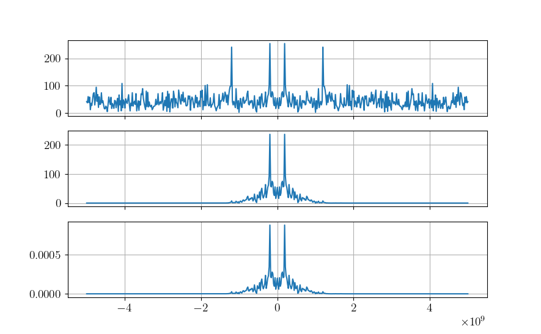

Problem 2
---------------

The following code generates a really annoying alternating set of beeping sounds between a low frequency (less annoying) and high frequency (extremely annoying).  CD audio samples at 44.1 kHz, and the human audible spectrum is between 20 Hz and 20 kHz, although, most people are deaf a lower than 20 kHz...

.. code-block:: python

    import numpy as np
    from scipy.io.wavfile import write

    rate = 44100 #Sampling Rate (Hz)
    LOW_FREQ = 300  # Low frequency (Hz)
    HIGH_FREQ = 2000  # High frequency (Hz)
    PULSE_DURATION = 0.5  # Duration for each pulse (seconds)
    NUM_PULSES = 10  # Number of pulses for each frequency

    # Generate a single pulse for a given frequency
    def generate_pulse(freq, duration, fs):
        t = np.arange(int(fs * duration))
        return np.sin(2 * np.pi * freq * t / fs) 

    # Create pulsed signal
    low_pulse = generate_pulse(LOW_FREQ, PULSE_DURATION, rate)
    high_pulse = generate_pulse(HIGH_FREQ, PULSE_DURATION, rate)

    # Concatenate the pulses to alternate between low and high frequencies
    signal = np.tile(np.concatenate([low_pulse, high_pulse]), NUM_PULSES)

    scaled = np.int16(signal / np.max(np.abs(signal)) * 32767)
    write('output_audio.wav', rate, scaled)

Your task is to create filters to 
1. Read the ``output_audio.wav`` into a numpy array and filter out the high frequency (2 kHz signal).  Save the new signal as a new audio file and enjoy the "relaxing" low frequency pulse.

.. code-block:: python

    import numpy as np
    from scipy.io.wavfile import write, read

    rate = 44100
    LOW_FREQ = 300  # Low frequency (Hz)
    HIGH_FREQ = 2000  # High frequency (Hz)
    PULSE_DURATION = 0.5  # Duration for each pulse (seconds)
    NUM_PULSES = 10  # Number of pulses for each frequency
    signal = read('output_audio.wav')[1]/32767.0

    # Design the LPF and filter it here
    #new_signal = filter_signal(signal) 

    scaled = np.int16(new_signal / np.max(np.abs(new_signal)) * 32767)

    write('filtered_out_high_audio.wav', rate, scaled)


