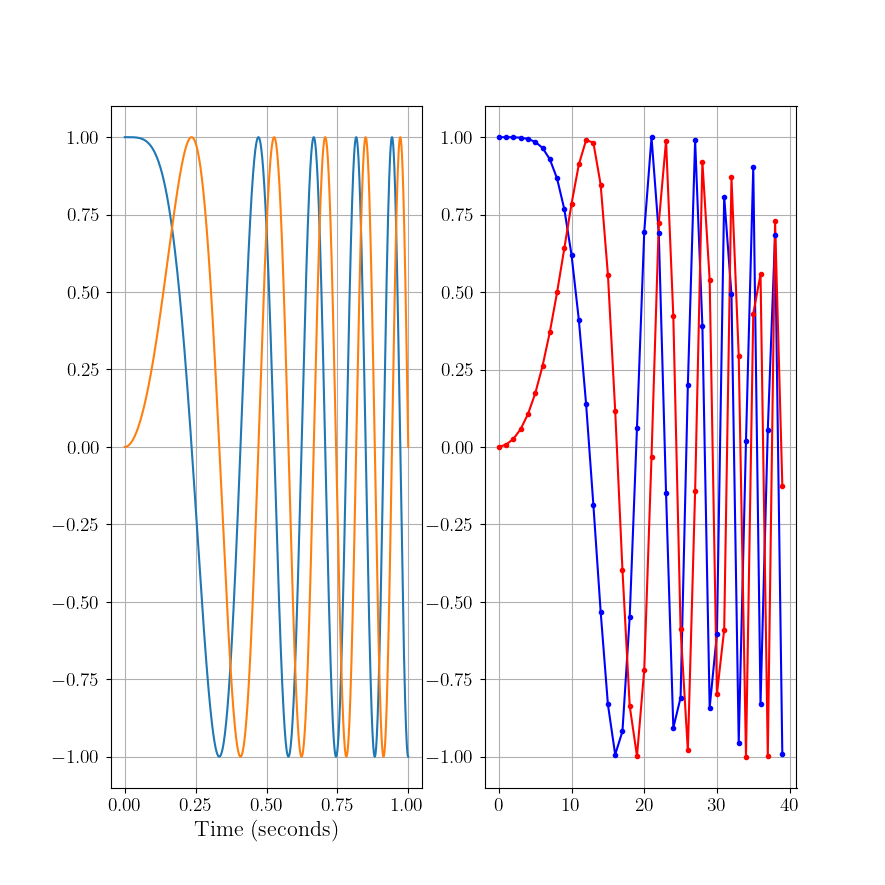

===================================
Lab 2 - Transmitter and Receivers
===================================

A transmitter converts bits into symbols which modulate electromagnetic propagation.  A receiver takes the modulated electromagnetic radiation syncs with symbols, demodulates, and produces bits.  The bits to bits pipeline is typically called the Physical layer, and will be the focus here.

In Phase & Quadrature (IQ)
===========================

In-phase Quadrature (IQ) signals are used extensively in signal processing and telecommunications. IQ representation of a signal is essential for the modulation and demodulation processes in communication systems.

To understand IQ signals, let's start with an introduction to basic concepts:

- **Baseband signal**: A signal with frequency components that are close to zero (around DC). It's the original frequency band of a signal before it's modulated for transmission. 

- **Passband signal**: A signal that has been modulated to a higher frequency band for transmission. It's called a passband signal because it's within the frequency band, or "passband," of the transmission channel.

- **In-phase component (I component)**: This is the real part of a signal. 

- **Quadrature component (Q component)**: This is the imaginary part of a signal.

Baseband IQ Representation
---------------------------

In the baseband IQ representation, a signal is represented by its I and Q components. The I component is the projection of the signal onto the real (or X) axis, and the Q component is the projection onto the imaginary (or Y) axis. You can think of an IQ signal as a 2D vector in this I-Q plane, with the I component representing the magnitude of the signal on the x-axis and the Q component representing the magnitude of the signal on the y-axis.

In Python, you can create an IQ signal like this:

.. code-block:: python

    import numpy as np
    import matplotlib.pyplot as plt

    # Number of samples
    N = 1000

    # Time array
    t = np.linspace(0, 2, N)

    # IQ components
    I = np.cos(2 * np.pi * t)
    Q = np.sin(2 * np.pi * t)

    # IQ signal
    s = I + 1j*Q

    # Plotting I, Q and IQ signal
    plt.figure(0)

    # Plots
    plt.plot(t, I)
    plt.plot(t,Q)
    plt.legend(['In-Phase Component (I)','Quadrature Component (Q)'])
    plt.xlabel('Time')
    plt.ylabel('Amplitude')
    plt.show()


**Important Note:**  The baseband IQ represenation is a complex value, and in practice requires two data streams (for digital) or physical ports resources (for analog).  


We first expand to look at other types of signals used in radar and/or comms
Sure, let's dive into each of these topics.

1. **Linear Frequency Modulation (LFM) / Frequency Modulation (FM)**:
   - LFM, commonly known as a chirp in radar systems, is a signal in which the frequency changes linearly with time.
   - In an LFM signal, the instantaneous frequency increases or decreases at a constant rate over the duration of the pulse.
   - It's extensively used in radar and sonar systems, especially in pulse compression techniques, where the goal is to maintain a long pulse duration for energy purposes while achieving the range resolution of a shorter pulse through signal processing.
   - The term "chirp" comes from the similarity to the sound some birds make, which can vary in frequency.

.. code-block:: python

    import numpy as np
    import matplotlib.pyplot as plt
    plt.close('all')
    t = np.linspace(0,1,1000) #Time Seconds
    fmin = -5 #Start Frequency Hz
    fmax = 5 #Stop Frequency Hz
    modulation_time = 1 #Seconds
    f = np.linspace(fmin,fmax,len(t))

    # Analog
    lfm_signal = np.exp(1j * np.pi * (fmax-fmin)/modulation_time * t**2)

    fig,ax = plt.subplots(1,2)
    ax[0].plot(t,np.real(lfm_signal))
    ax[0].plot(t,np.imag(lfm_signal))
    ax[0].set_xlabel('Time (seconds)')


    #Digital (way oversampled for visual, Nyquist would be >20 Hz)
    Fs = 1000 #Sampling Rate Hz
    num_samples = 40
    f = np.linspace(fmin,fmax,num_samples)
    lfm_signal_dig = np.exp(1j * 2*np.pi/Fs * np.cumsum(f *np.arange(num_samples)))
    ax[1].plot(np.real(lfm_signal_dig),'b')
    ax[1].plot(np.imag(lfm_signal_dig),'r')
    ax[1].plot(np.real(lfm_signal_dig),'b.')
    ax[1].plot(np.imag(lfm_signal_dig),'r.') 




2. **Nonlinear Frequency Modulation (NLFM)**:
   - Unlike LFM, where the frequency changes at a constant rate, in NLFM, the rate of change of frequency is non-constant.
   - The goal of NLFM is often to achieve a constant time-bandwidth product but with a sidelobe level that is lower than what's achieved with LFM.
   - In some applications, using NLFM can reduce the peak sidelobes in the autocorrelation function, which can reduce the probability of range sidelobe false alarms in radar systems.
   - Designing and implementing NLFM waveforms can be more complex than LFM waveforms.

BPSK (Binary Phase Shift Keying) in the context of sensing or radar, especially in wireless sensor networks or remote sensing, has some unique applications and advantages. Sensing often requires sending out a known signal and examining how the environment modifies it, or it involves encoding the sensed data for transmission back to a base station.

3. **Binary Phase Shift Keying (BPSK)**:
   - BPSK is a modulation scheme where data bits modulate the phase of a reference signal (carrier wave).
   - Specifically, there are two possible phase states: 0 degrees for binary "0" and 180 degrees for binary "1" (or vice versa). The magnitude or frequency of the carrier remains unchanged.
   - BPSK is a simple and robust modulation scheme, offering good resilience against noise and interference. However, it doesn't use bandwidth as efficiently as higher order modulation schemes. This means it's slower in terms of data rate for the same bandwidth in communications.
   - Radar systems send out pulses and listen for echoes to detect and locate objects. BPSK can modulate these pulses with a binary code, enhancing detection capabilities by correlating the received signal with the known transmitted sequence.  Longer sequences lead to higher gain, see [1] for more detail.
   - BPSK-modulated radar pulses can achieve better range resolution using pulse compression techniques.
   - It's commonly used in deep space communication, digital modems, and other applications where data integrity is more crucial than bandwidth efficiency.


.. code-block:: python

    import numpy as np
    import matplotlib.pyplot as plt
    plt.close('all')

    t = np.linspace(0,1.3,1300)
    Fs = 1000 #Sample Rate Hz
    chip_rate = .1 #Seconds
    samples_per_chip = int(Fs*chip_rate)

    sequence = np.array([1,1,1,1,1,-1,-1,1,1,-1,1,-1,1]) #13 Bit Barker Code

    # Analog/Digital
    bpsk_signal = np.repeat(sequence,samples_per_chip)

    fig,ax = plt.subplots()
    ax[0].plot(t,np.real(bpsk_signal))
    ax[0].plot(t,np.imag(bpsk_signal))
    ax[0].set_xlabel('Time (seconds)')


Passband IQ Representation
---------------------------


In the previous lab, you worked with a signal that was all-real, hence the baseband representation is also real.  **The main takeaway from this subsection is that ANY signal may be represented as real OR complex**.

In passband representation, the baseband IQ signal is modulated to a higher frequency for transmission. Why does it need to be at a certain frequency?
Let's approach this using an analogy:

Imagine you have a variety of different-sized musical instruments: a large drum, a middle-sized guitar, and a small flute. Each of these instruments is designed to resonate or produce sound at particular frequencies. The drum produces low-pitched sounds (low frequencies), the guitar produces mid-pitched sounds (middle frequencies), and the flute produces high-pitched sounds (high frequencies). If you try to play a high-pitched song on the drum, it wouldn't sound right. Similarly, trying to get deep bass tones out of a flute would be futile. The physical design and size of each instrument make it naturally suited for specific tones or frequencies. Antennas are somewhat similar to musical instruments in this context. An antenna's size and shape determine which frequencies it can efficiently "play" or resonate with. When radio waves of a specific frequency hit an antenna, if the antenna is of the right size and design for that frequency, it resonates efficiently, turning those radio waves into electrical signals (or vice versa: turning electrical signals into radio waves). However, if you send radio waves of an unsuitable frequency to an antenna (like trying to get bass out of a flute), the antenna won't resonate well. It might still pick up the signal, but not efficiently, leading to weak reception or transmission.  So, just as you'd pick a specific musical instrument for a particular pitch or frequency range, engineers choose or design antennas for specific frequency ranges based on their applications. It ensures efficient transmission and reception of signals in communication systems.  


Reaching a higher frequency is typically achieved by mixing the baseband IQ signal with a **carrier** signal. The I component is mixed with a cosine wave, and the Q component is mixed with a sine wave.

The passband signal :math:`s(t)` can be expressed as:

:math:`s(t) = I(t)\cos(2\pi f_c t) - Q(t)\sin(2\pi f_c t)`

where :math:`f_c` is the carrier frequency.

In Python, you can modulate a baseband IQ signal to a passband signal as shown below, note that I and Q are just placeholders and need to be defined for the code to work:

.. code-block:: python

    # Carrier frequency
    fc = 10e6

    # Passband signal
    s_passband = I * np.cos(2 * np.pi * fc * t) - Q * np.sin(2 * np.pi * fc * t)

    # Plotting passband signal
    plt.figure()
    plt.plot(t, s_passband)
    plt.title('Passband Signal')
    plt.xlabel('Time')
    plt.ylabel('Amplitude')
    plt.show()


In this tutorial, we saw how to represent a signal in baseband IQ form and passband form. Note that the passband representation is used for the actual transmission of the signal, and at the receiver side, the signal would be demodulated back to baseband for processing.  Balancing this link budget is done using the Friis transmission equation, but when I called it that on my first day of work I got a perplexed look from a senior engineer who corrected me that it was the...

Radar Range Equation
======================

**Radar** stands for **RAdio Detection And Ranging**. It's essentially a system that uses electromagnetic waves to detect objects, measure their distance, speed, and other characteristics.

Imagine you're in a pitch-black room, and you want to detect if someone's there. One way is to shout and listen for an echo. If someone's in the room, the sound bounces off them and returns to you as an echo. Based on the time it takes for the echo to return, you can estimate how far away they are.

Radar does something similar but uses radio waves instead of sound waves.

The radar range equation relates the range (distance) of a target to several factors:

1. **Transmitted Power** (:math:`P_t`): The amount of energy the radar sends out.
2. **Transmitter Antenna Gain** (:math:`G_t`): A measure of how "focused" the transmitted/received energy is in a particular direction.
3. **Receiver Antenna Gain** (:math:`G_r`): A measure of how "focused" the transmitted/received energy is in a particular direction.
4. **Radar Cross Section** (:math:`\sigma`): A measure of how much radio energy an object reflects back towards the radar. Large metal objects have a high :math:`\sigma`; stealth aircraft are designed to have a low :math:`\sigma`.
5. **Frequency** (:math:`f`) or Wavelength (:math:`\lambda`): The frequency/wavelength of the radio wave used.
6. **Range** (:math:`R`): The distance between the radar and the target.

The basic radar equation looks like this:

:math:`P_r = \frac{P_t  G_t G_r  \lambda^2  \sigma}{(4\pi)^3  R^4 }`

Where:
- :math:`P_r` is the received power.
- :math:`\lambda` is the wavelength of the transmitted signal.
- Note that often the case with radars is :math:`G_r = G_t = G`

**Layman Explanation**

Think of :math:`P_t` as the loudness of your shout, and :math:`P_r` as how loud the echo is when it returns. 

- If you shout louder (higher :math:`P_t`), you'll hear a louder echo (higher :math:`P_r`).
- If the person (or object) you're trying to detect is closer (smaller :math:`R`), the echo will be louder.
- If the person is wearing reflective clothing (think of this as a higher :math:`\sigma`), they'll reflect more sound and produce a louder echo.

**Antenna Gain (:math:`G`)** is like cupping your hands around your mouth when shouting (and ears when listening). It focuses the sound in a particular direction, making it louder in that direction and quieter in others.

Finally, the receiver's sensitivity is akin to your hearing ability. If you have sharp hearing, you can detect even faint echoes.


The radar range equation is fundamental in radar technology. It provides a relationship between how far away an object is and how easy it is to detect, given various parameters about the radar system and the target. This knowledge is crucial in both radar design.  The follow presentation by MIT Lincoln Labs provides an excellent introduction and overview of each piece:  https://www.ll.mit.edu/sites/default/files/outreach/doc/2018-07/lecture%202.pdf and [2] also has a good introduction

Power
=========

**Continuous Domain (Analog Signals):**

For a continuous-time signal :math:`x(t)`, the **power** is defined as the average power over an interval. 

For non-periodic signals, the average power :math:`P` over all time is given by:

:math:`P = \lim_{T \to \infty} \frac{1}{2T} \int_{-T}^{T} |x(t)|^2 \, dt`

For periodic signals with period :math:`T_0`, the average power :math:`P` is:

:math:`P = \frac{1}{T_0} \int_{0}^{T_0} |x(t)|^2 \, dt`

Where:
- :math:`x(t)` is the signal.
- :math:`T_0` is the period of the signal.

**Discrete Domain (Digital Signals):**

For a discrete-time signal :math:`x[n]`, the power is similarly defined. 

For non-periodic sequences, the average power :math:`P` over all time is:
:math:`P = \lim_{N \to \infty} \frac{1}{2N + 1} \sum_{n=-N}^{N} |x[n]|^2`

For periodic sequences with period :math:`N_0`, the average power :math:`P` is:
:math:`P = \frac{1}{N_0} \sum_{n=0}^{N_0-1} |x[n]|^2`

Where:
- :math:`x[n]` is the signal.
- :math:`N_0` is the period of the sequence.

In plain English, sum of squared absolute value of elements averaged over the length of the sequence.  A scaling factor :math:`P` may be applied to a vector/array in order to obtain an "amplification" or "attenuation".

.. code-block:: python

    import numpy as np
    import matplotlib.pyplot as plt

    # Time variable
    t = np.linspace(0, 1, 500, endpoint=False)

    #Signal Power
    P = 2

    # A 5 Hz waveform
    a = np.sqrt(P) * np.cos(2 * np.pi * 5 * t)

    power_a = np.sum(np.abs(a)^2)/len(a)


**Notes**:

1. The power of a signal represents the energy per unit of time. 

2. If a continuous or discrete signal's energy is finite, and its duration is infinite, then we speak of the signal's power rather than its energy.

3. If the power is finite for a signal that extends from :math:`-\infty` to :math:`\infty`, then the signal is referred to as a power signal. If the energy is finite but the power is infinite, the signal is called an energy signal.


Noise Models
================

The performance of a communication receiver is significantly impacted by noise. Noise, in a receiver, generally refers to random and unpredictable electrical signals that can degrade the quality of the received signals. This noise can originate from various sources both external and intrinsic to the receiver components.

Here are the most common types of noise in a receiver:

1. **Thermal Noise (or Johnson-Nyquist Noise):** This noise originates due to the random motion of electrons in a conductor. Its power is proportional to temperature and bandwidth. It's present in all electronic devices and components. Given by the equation:
   :math:`N = k \times T \times B`
   where :math:`k` is Boltzmann's constant, :math:`T` is the absolute temperature, and :math:`B`  is the bandwidth.

2. **Shot Noise:** This noise results from the discrete nature of electron charge. It's more prominent in semiconductor devices like diodes and transistors. The power of shot noise is proportional to the DC current and the bandwidth.

3. **Quantization Noise:** Relevant in digital receivers, this type of noise arises when analog signals are converted to digital. It depends on the resolution of the Analog-to-Digital Converter (ADC).

4. **Phase Noise:** Important in frequency synthesizers and oscillators, phase noise relates to the purity of the generated signals in terms of phase. It can affect the performance of systems, especially in higher order modulation schemes.

5. **Intermodulation Noise:** This type of noise arises when two or more different frequencies mix and create undesired additional frequencies, which can fall into the desired band and become a form of interference.

6. **Flicker (:math:`1/f`) Noise:** This is low-frequency noise and is more prominent in some semiconductor devices at low frequencies.

7. **Environmental Noise:** This includes interference from nearby electronic devices, cosmic sources, and even solar radiation.

When designing or analyzing a receiver, engineers often consider the **Noise Figure (NF)** or **Noise Factor (F)**, which is a measure of how much the Signal-to-Noise Ratio (SNR) deteriorates as a signal passes through a component or system. A perfect component (with no noise) would have an NF of 0 dB, while real-world components always have an NF greater than 0 dB, some typical values range between 3-5 dB.

Often, in receiver design and analysis, noise is modeled as Additive White Gaussian Noise (AWGN), which assumes that noise is added to the signal and has a Gaussian distribution. This is a simplification, but it provides a reasonable model for many communication system analyses.  The python code below shows how to develop such a model based on thermal noise that is 100% in band.

.. code-block:: python

    import numpy as np

    k = 1.38e-23 #Boltzmann's Constant
    T = 290 #Kelvin
    NF = 10**(5/10) #Noise Factor in Linear units
    B = 1e6 #Bandwidth

    sigma = np.sqrt(k * T * NF * B)


:math:`\sigma^2` is the noise **variance**, and when compared to the signal power, :math:`P` provides the **Signal-to-Noise Ratio (SNR)**, often represented by :math:`\chi`.  

:math:`\chi = \frac{P}{\sigma^2}`

Interference may be causing additional noise :math:`\sigma_i^2` from an :math:`i^{th}`source, the Signal-to-Interference-plus-Noise Ratio (SINR) is 

:math:`\frac{P}{\sigma^2 + \sigma_1^2 + \dots + \sigma_i + \dots}`

Note that interference models are generally much more complex.

Building from our example from lab1, if all noise is in-band, i.e. AWGN:

.. code-block:: python

    import numpy as np
    import matplotlib.pyplot as plt

    # Time variable
    t = np.linspace(0, 1, 500, endpoint=False)

    #Signal Power
    P = 1

    # A 5 Hz waveform
    a = np.sqrt(P) * np.cos(2 * np.pi * 5 * t)

    #Noise variances
    sigmas = [.1, 1, 10]

    fig,ax = plt.subplots(3,1)
    for ii,sigma in enumerate(sigmas):
        n = sigma * np.random.randn(len(a))
        a = a + n
        ax[ii].plot(t, a, label = f'SNR: {int(10*np.log10(P/sigma))}')
        ax[ii].legend(loc = 'lower right', fontsize = 8)

    plt.show()


References and Further Reading
[1] Scheer, Jim, and William A. Holm. "Principles of modern radar." (2010): Chapter 20 Section 12.
[2] Scheer, Jim, and William A. Holm. "Principles of modern radar." (2010): Chapter 2.
[3]  Richards, Mark A. Fundamentals of radar signal processing McGraw-Hill Education, 2014: Chapter 6

Project 
=========

The problems for this lab pertain to creating your own radar simulation, much more information can be found on the broad topic of radar in the MIT Lincoln Labs Introduction to Radar Course, in particular, the first lecture https://www.ll.mit.edu/sites/default/files/outreach/doc/2018-07/lecture%201.pdf.

In particular, you will build this...


Problem 1
-----------

Cool, so let's build a radar receiver, but first, a little bit about Python objects/classes, we instantiate a class as 

.. code-block:: python

class Person:
        def __init__(self, age, name, eye_color):
            self.age = age
            self.name = name
            self.eye_color = eye_color
            
        def calculate_age_plus_five_years(self):
            return self.age + 5

The object class ``Person`` has accepts arguments ``name``, ``eye_color``, and ``age`` and assigns them to attributes that don't necessarily need to be name the same thing.  We instantiate an instance of ``Person`` as 

.. code-block:: python

    bob = Person(45,'Bob', 'Brown')


We can do some hardcore math with the method ``calculate_age_plus_five_years`` and calclate Bob's age plus 5 years, which is 50.  

.. code-block:: python

    bob.calculate_age_plus_five_years()

It's often useful to define model components as objects, for example, a Butterworth filter might use the following object wrapper

.. code-block:: python

    from scipy.signal import butter

    class ButterFilter:
        def __init__(self,N,Wn,fs,btype):
            self.N = N      #Filter order
            self.Wn = Wn    #Window limits, if low pass or high pass, it's the cutoff frequency, if bandpass, it's a tuple of start and stop
            self.Fs = fs    #Sampling Frequency
            self.btype = btype #Filter type "bandpass", "low", "high"
            
            self.b,self.a = butter(N = N, Wn = Wn, fs = fs, btype = btype)
        
        def filter_signal(self,x): return lfilter(self.b,self.a,x)


We instantiate ``ButterFilter`` as

.. code-block:: python

    mybutterfilter = ButterFilter(...)


and filter signals by invoking the method ``mybutterfilter.filter_signal(x)``.  

**DO THIS** Your first task is to create a Python ``class`` called ``Receiver`` with attributes corresponding to:

* RF Sampling Frequency in Hz - 500 MHz
* Intermediate Frequency (IF) Sampling Frequency in Hz - 100 MHz
* Baseband (BB) Sampling Frequency in Hz - 25 MHz
* RF Center Frequency in Hz - 115 MHz
* RF Bandwidth in Hz - 10 MHz

Your class should include a function called ``__init__`` that receives args 

* ``rf_sampling_frequency_hz``
* ``if_sampling_frequency_hz``
* ``bb_sampling_frequency_hz``
* ``rf_center_frequency_hz``
* ``rf_bandwidth_hz``

and assigns them to object attributes, for example, ``self.fc_rf = rf_center_frequency_hz``.  Your ``__init__`` function should also initialize three filters 

* Butterworth front end wideband bandpass reject filter order 2 with limits 110 MHz and 120 MHz (covers the RF bandwidth)
* Chebyshev (use ``scipy.signal.cheby1``) low pass order 5 with ripple factor 2 and cutoff 20 MHz
* FIR (use ``scipy.signal.firwin``) with 31 taps and cutoff frequency of 1 MHz

Your object, ``Receiver``, should finally include a method for processing an incoming signal using components you've defined, for example

.. code-block:: python

    def process_signal(self,wf_object,x):
        ### FOR PLOT PROCESSING ONLY ##########################
        fig,axes = plt.subplots(3,2)
        freq = np.linspace(-self.Fs_rf/2,self.Fs_rf/2,len(x))
        axes[0,0].plot(freq/1e6,affts(x))
        axes[0,0].set_xlabel('MHz')
        axes[0,1].plot(np.real(x))
        axes[0,1].plot(np.imag(x))
        #######################################################
        
        x = self.apply_bpfrontend(x) #Apply the Butterworth filter you constructed
        #Downsample by a factor of 5
        
        ### FOR PLOT PROCESSING ONLY ##########################
        freq = np.linspace(-self.Fs_if/2,self.Fs_if/2,len(x))
        axes[1,0].plot(freq/1e6,affts(x),'b')
        axes[1,0].set_xlabel('MHz')
        #######################################################
        
        # Apply the Cheby1 IF filter you constructed
        
        ### FOR PLOT PROCESSING ONLY ##########################
        axes[1,1].plot(np.real(x))
        axes[1,1].plot(np.imag(x))
        #######################################################
        
        #Downconvert to BB using a complex exponential.
        
        ### FOR PLOT PROCESSING ONLY ##########################
        axes[1,0].plot(freq/1e6,affts(x),'r')
        #######################################################
        
        #Apply the FIR BB filter
        #Downsample by a factor of 4
        
        ### FOR PLOT PROCESSING ONLY ##########################
        freq = np.linspace(-self.Fs_bb/2,self.Fs_bb/2,len(x))
        axes[2,0].plot(freq/1e6,affts(x))
        axes[2,0].set_xlabel('MHz')
        axes[2,1].plot(np.real(x))
        axes[2,1].plot(np.imag(x))
        #######################################################
        #...
    return x

    def ffts(x): return np.fft.fftshift(np.fft.fft(x))/len(x)
    def affts(x): return np.abs(ffts(x))


The downsample factor causes the original signal to alias the original RF center frequency to 15 MHz,  we use a 35 MHz cutoff in the Cheby1 filter to restrict the signal at IF.  The rest of the ``process_signal`` method should apply the Cheby1 IF filter, then multiply by a complex sinusoid at  the IF, which can be calculated by 

.. code-block:: python

    self.fc_if = np.mod(rf_sampling_frequency_hz,if_sampling_frequency_hz)


MHz to downconvert to baseband.  Once at baseband, apply the FIR filter you defined and downsample by a factor of 4 to reach your BB sampling frequency.  This process models the RF front end of a receiver for conversion from analog to baseband.

Write a test script to process the following LFM signal sampled at the RF receiver frequency, first instantiate an instance of your ```Receiver``` object, call it ```myreceiver``` or something that makes sense to you.

.. code-block:: python

    pulse_width = 10e-6
    Fs_rf = 500e6
    fc_rf = 115e6
    lfm_min = -1e6
    lfm_max = 1e6
    signal_length_samples = int(pulse_width * Fs_rf) #5000
    x = np.exp(1j * 2 * np.pi/Fs_rf * (fc_rf *np.arange(signal_length_samples) + np.cumsum(np.linspace(lfm_min,lfm_max,signal_length_samples))))

The end result should look like the following:

.. image:: media/rfchaintest.png

Problem 2
------------

In the first problem, you modeled the RF front end of a receiver.  Generally, the first two filter chains represent analog processes, which we try to capture functionality of in a computer simulation with discrete numbers.  A lot of times, the front end may be bypassed altogether in a model if it is not impacting to the overall setup trying to be modeled.  We now shift our focus to the signal processor, the meat of the backend that processes the raw sampled digital signal.  

**DO THIS** Create a new Python class called ``SinglePulseWaveform`` with that has the following attributes:

* Pulse Width in seconds - 10 us
* Pulse Repetition Interval in seconds - 1000 us
* Linear Frequency Modulation Excursion in Hz- 2 MHz
* RF Sampling Frequency in Hz - 500 MHz
* Intermediate Frequency (IF) Sampling Frequency in Hz - 100 MHz
* Baseband (BB) Sampling Frequency in Hz - 25 MHz
* RF Center Frequency in Hz - 115 MHz
* RF Bandwidth in Hz - 10 MHz

and accepts the following arguments:

* pulse_width_s
* pulse_repetition_interval_s
* lfm_excursion_hz
* rf_sampling_frequency_hz 
* if_sampling_frequency_hz 
* bb_sampling_frequency_hz 
* rf_center_frequency_hz 

Assign each argument to a class attribute, similar to Problem 1.  It is of critical importance that we understand the number of samples in our timing intervals, be that a pulse width, pulse repetition interval, or in more complex cases, the coherent processing interval.  It is helpful to define a series of class attributes that precalculate these, for example, within your ```SinglePulseWaveform``` class,

.. code-block:: python

    class SinglePulseWaveform:
        def __init__(self,
                     pulse_width_s,
                     #...
                     ):
                     self.pw = pulse_width_s
    #...
        self.samples_per_pw_rf = int(self.pw * rf_sampling_frequency_hz)
        self.samples_per_pw_if = int(self.pw * if_sampling_frequency_hz)
        self.samples_per_pw_bb = int(self.pw * bb_sampling_frequency_hz)
   

The above snippet has precalculations for the number of samples in a pulse at the various sampling rates we use in our receiver.  Add these for the pulse width and pulse repetition interval.  Add a third set of attributes for the number of samples in the receiving window, more on this later, but for now use the snippet below.  Additionally, for single pulse modes, we are only interested in a critical processing interval (CPI) of one pulse.

.. code-block:: python

    self.samples_per_range_window_rf = self.samples_per_pri_rf - self.samples_per_pw_rf
    self.samples_per_range_window_if = self.samples_per_pri_if - self.samples_per_pw_if
    self.samples_per_range_window_bb = self.samples_per_pri_bb - self.samples_per_pw_bb
    
    self.samples_per_cpi_rf = int(1 * self.samples_per_pri_rf)
    self.samples_per_cpi_if = int(1 * self.samples_per_pri_if)
    self.samples_per_cpi_bb = int(1 * self.samples_per_pri_bb)


**DO THIS** Create an array representing the LFM pulse signal described by the class attributes in ```SinglePulseWaveform```, note the sampling frequency is at RF.

.. code-block:: python

    self.wf_single_pw = np.exp(1j * 2 * np.pi/self.Fs_rf * (self.fc_rf *np.arange(self.samples_per_pw_rf) + np.cumsum(np.linspace(self.fmin_bb,self.fmax_bb,self.samples_per_pw_rf))))


Concatenate ``self.wf_single_pw`` with zeros (use ``np.concantenate`` and ``np.zeros``) to form an array that represents one PRI.  The number of zeros should be specified by ``self.samples_per_range_window_rf``.  When specifying the array of zeros, it's often good practice to add ``0j`` to complexify it.  Sometimes Python will only preserve the real portion otherwise.  Name the final attribute of concatenated ``self.wf_single_pw`` and zeros as ``self.wf``

Finally, add attributes for the matched filter taps at BB, I also like to add an attribute that's a custom BB FIR (similar to what you constructed in Problem 1) custom to the waveform I'm describing so that I don't mess things up later.

.. code-block:: python

    self.mf_wf_bb = np.exp(1j * 2 * np.pi/self.Fs_bb * (np.cumsum(np.linspace(-lfm_excursion_hz/2,lfm_excursion_hz/2,self.samples_per_pw_bb))))
    self.bb_filter = FIR(numtaps = 31, cutoff = lfm_excursion_hz/2, fs = self.Fs_bb)


Create an instance of ``SinglePulseWaveform`` called ``mywf`` with the argument values listed above as an attribute to your ``Receiver`` object in Problem 1.  Use the function ``process_signal`` on ``mywf.wf_single_pw`` that you constructed in Problem 1 for the RF frontend.  Apply your the matched filter by appending the following at the end of the  ``process_signal`` function

.. code-block:: python

    x = np.convolve(x,np.conj(self.mywf.mf_wf_bb), mode = 'same')


The output should look like 

.. image:: media/mftest.png

Problem 3
----------


(graphic from https://www.researchgate.net/figure/Radar-signal-concept_fig1_276184180)

All radar detection is based on delays relative to intervals in which measurements are processed.  In this problem, you'll be shown how to simulate a delay within that interval.  Let's say we have a target out at 50 km, with our chosen :math:`T_{\textnormal{PRI}} = 1000` us we can detect a target, unambiguously, out to 

:math:`R_\textnormal{ua} = cT_{\textnormal{PRI}}/2 = 150 \textnormal{km}`

where :math:`c = 3\times 10^8` m/s is the speed of light in free space.  We can simulate the return signal within our receive window as 

.. code-block:: python

    #Calculate index of signal presence
    d = 50000 #distance of target in meters
    distance_samples_skin_return_m = np.arange(myreceiver.mywf.samples_per_cpi_rf) / myreceiver.Fs_rf * 3e8/2
    print(f'Maximum Distance: {np.max(distance_samples_skin_return_m)}, Target Distance: {d}')
    min_range_sample_to_d = np.argmin(np.abs(distance_samples_skin_return_m-d))

    #Truncate return signals outside cpi, and concatenate zeros
    x = dcp(myreceiver.mywf.wf)
    fig,axes = plt.subplots()

    x = x[:(myreceiver.mywf.samples_per_cpi_rf-min_range_sample_to_d)]
    x = np.concatenate([np.zeros(myreceiver.mywf.samples_per_cpi_rf-len(x)) + 0.0j,x])


**DO THIS** Process ``x`` in the above snippet using your ``process_signal`` function constructed in Problem 1, then apply your matched filter from the ``SinglePulseWaveform`` instance you created, ``mywf``.  The output should look like the following, note the delay is roughly a third of the way through the overall receive window samples.  Matching this sample to a moment in time, then scaling by :math:`c/2` provides the distance estimation of the target.  But how do designate something as a detection, or not?  Surely noise can trigger detections if significant enough, let's find out in the next lab...


Problem 4
-------------

So far we have only dealt with the noiseless response of the transmitter and receiver, in fact we are using the default magnitude (power) of the signals in the model that Python prescribes.  Let's calibrate this to match a situation in real life.

We can scale the transmit power of the waveform as follows, for a transmit power of :math:`P_t`,

.. code-block:: python

    transmit_signal = np.sqrt(P_t) * wf_rf
   

**DO THIS** Create the following classes:

Let's add a wrapper class, ```Transmitter``` as

.. code-block:: python

    class Transmitter:
        def __init__(self,
        
                    #Spatial Parameters
                    x_loc_m = 0.0, 
                    y_loc_m = 0.0,
                    z_loc_m = 3.0, 
                    x_vel_mps = 0.0,
                    y_vel_mps = 0.0,
                    z_vel_mps = 0.0,
                    x_acc_mps2 = 0.0,
                    y_acc_mps2 = 0.0,
                    z_acc_mps2 = 0.0,
                    
                    #Transmitter and Sampling Parameters
                    rf_sampling_frequency_hz = 500e6,
                    if_sampling_frequency_hz = 100e6,
                    bb_sampling_frequency_hz = 25e6,
                    rf_center_frequency_hz = 115e6,
                    rf_bandwidth_hz = 10e6,
                    transmit_power_w = 100):
                    
            self.state = np.array([x_loc_m,y_loc_m,z_loc_m,x_vel_mps,y_vel_mps,z_vel_mps]) 
            self.Fs_rf = rf_sampling_frequency_hz
            self.Fs_if = if_sampling_frequency_hz
            self.Fs_bb = bb_sampling_frequency_hz
            self.fc_rf = rf_center_frequency_hz
            self.fc_if = np.mod(rf_center_frequency_hz,if_sampling_frequency_hz)
            self.rf_bw = rf_bandwidth_hz
            self.Ptx = transmit_power_w

        def transmit_waveform(self,wf_object):
            return np.sqrt(self.Ptx) * wf_object.wf()


Go ahead and and add the spatial parameters, i.e., ``x_loc_m``, ``y_loc_m``, etc. to your ``Receiver`` class as well.  Pull out the instantiation of the ``SinglePulseWaveform`` object, don't delete it!  Modify your ``Receiver`` class to accept an argument 

``receiver_noise_figure_db``

with a default value of 5 dB.  Make it an attribute in linear units, and compute the noise standard deviation, :math:`\sigma_n`

.. code-block:: python

    self.NF_lin = 10**(receiver_noise_figure_db/10)
	self.sigma_n = np.sqrt(1.38e-23 * 290 * rf_bandwidth_hz * self.NF_lin)


Now add a method 

.. code-block:: python

    def add_receiver_noise(self,x): return x + self.sigma_n/np.sqrt(2) * (np.random.randn(len(x)) + 1j*np.random.randn(len(x)))


Finally, insert the ``add_receiver_noise`` method into your ``process_signal`` method you created earlier after the front end RF filter, but before the IF filter.

.. code-block:: python

    x = self.add_receiver_noise(x)


*Caution* We need to be careful, if the entire RF bandwidth is not processed in the RF chain, we need to adjust the noise bandwidth settings separately.  The revised ``process_signal`` method should be modified to match 

.. code-block:: python

    def process_signal(self,x,wf_object):
            fig,axes = plt.subplots()
            x = self.apply_rf2if_filter(x) #Can be bypassed if you don't have anything out of band.
            x = x[::self.rf2if_ds]
            x = self.add_receiver_noise(x)
            x = self.apply_adc_filter(x)
            x = x * np.exp(-1j*2*np.pi/self.Fs_if * self.fc_if *np.arange(len(x)))
            x = wf_object.apply_bb_filter(x)
            x = x[::self.if2bb_ds]
            
            #fig.savefig('../SignalProcessingTutorial/figs/rfchaintest.png')
            x = np.convolve(x,np.conj(wf_object.mf_wf_bb), mode = 'same')
            axes.plot(np.abs(x))
            fig.savefig('./sim_test.png')
            return x


**DO THIS** Take things a step further and create ``Receiver`` and ``Transmitter`` as instantiations in (they don't necessarily have to be child classes, but can be handy when they are often co-located) a higher level wrapper class, ``Radar``.  Put the ``SinglePulseWaveform`` instantiation in the ``__init__`` function

.. code-block:: python

    class Radar:
        '''
        Basic single mode, single pulse radar
        '''
        def __init__(self):
            self.transmitter = Transmitter()
            self.receiver = Receiver()
            
            self.mywf = SinglePulseWaveform(pulse_width_s = 10e-6,
                                            pulse_repetition_interval_s = 1000e-6,
                                            lfm_excursion_hz = 2e6,
                                            rf_sampling_frequency_hz = self.receiver.Fs_rf,
                                            if_sampling_frequency_hz = self.receiver.Fs_if,
                                            bb_sampling_frequency_hz = self.receiver.Fs_bb,
                                            rf_center_frequency_hz = self.receiver.fc_rf)
                                            


**DO THIS** Add a class called ``Scatterer``:

.. code-block:: python

    class Scatterer:
        def __init__(self,
        
                    #Spatial Parameters
                    x_loc_m = 50000, 
                    y_loc_m = 0.0,
                    z_loc_m = 10000, 
                    x_vel_mps = 0.0,
                    y_vel_mps = 0.0,
                    z_vel_mps = 0.0,
                    x_acc_mps2 = 0.0,
                    y_acc_mps2 = 0.0,
                    z_acc_mps2 = 0.0,
                    
                    #Signature
                    radar_cross_section_dbsm = 0):
                        
            self.state = np.array([x_loc_m,y_loc_m,z_loc_m,x_vel_mps,y_vel_mps,z_vel_mps]) 
            self.rcs_dbsm = 0
            self.rcs_lin = 10**(self.rcs_dbsm/10)
                
        def get_scatterer_entity_geo(self,entity):
            ''' 
            x, y, and z distance relative to some entity, i.e. a transmitter.
            '''
            x = self.state[0] - entity.state[0]
            y = self.state[1] - entity.state[1]
            z = self.state[2] - entity.state[2]
            zoa = np.arctan(np.sqrt(x**2 + y**2)/z)
            aoa = np.sign(y) * np.arccos(x/np.sqrt(x**2 + y**2))
            d = np.sqrt((x)**2 + (y)**2 + (z)**2)
            return zoa,aoa,d


Finally, make a class called ``Simulation`` that acts as a common namespace and execution environment for your created entities. In the ``process_environment`` method, not the first few lines of code correspond to the previous Problem in that we set up the delay of the signal return.

.. code-block:: python

    class Simulation:
        '''
        Top level simulation class for a 1v1 target vs track radar
        '''
        def __init__(self):
        
            self.target = Scatterer()
                                    
            self.radar = Radar()
            
                
        def run_sim(self):
            wf_object = self.radar.mywf
            x = self.radar.transmitter.transmit_waveform(wf_object)
            
            #Truth target information
            zoa,aoa,d = self.target.get_scatterer_entity_geo(self.radar.transmitter)
            distance_samples_skin_return_m = np.arange(wf_object.samples_per_cpi_rf) / self.radar.receiver.Fs_rf * 3e8/2
            
            min_range_sample_to_d = np.argmin(np.abs(distance_samples_skin_return_m-d))
            
            #Truncate return signals outside cpi
            x = x[:(wf_object.samples_per_cpi_rf-min_range_sample_to_d)]
            
            x = np.concatenate([np.zeros(wf_object.samples_per_cpi_rf-len(x)) + 0.0j,x])
            
                
            #RRE
            G2 = 10**(30/10) #placeholder gain for antenna transmit and receive
            x = x * np.sqrt( G2 * (3e8/self.radar.transmitter.fc_rf)**2 * self.target.rcs_lin / d**4  / (4*np.pi)**3)
            
            x = self.radar.receiver.process_signal(x,wf_object)
            print(f'Maximum Distance: {np.max(distance_samples_skin_return_m)}, Target Distance: {d}')
            return x


Instantiate an instance of ``Simulation`` and run ``run_sim``

.. image:: media/sim_test.png

Problem 5
------------

How do we detect a signal out of noise?  While there is a lot of interesting mathematics within Detection Theory, we defer the interested reader to [3] for more detail.  

In general for a detection problem, we are interested in three quantities defined in [3]

* Probability of Detection (:math:`P_D`): The probability that a target IS declared when a target IS in fact present.
* Probability of False Alarm (:math:`P_{FA}`): The probability that a target IS declared when a target is in fact NOT present.
* Probability of Missed Detection (:math:`P_{MD}`): The probability that a target is NOT declared when a target IS in fact present.

A good detector will maximize :math:`P_D`, based on a user-choosen :math:`P_{FA}` as to not cause too many missed detections.  For now, we apply a barebones detector known as a Constant False Alarm Rate (CFAR), that works by comparing averages of sections of the return signal with itself.  In particular, we use the Cell- Averaging (CA) CFAR from Section 6.5.4 of [3], which calculated a threshold based on the samples around the "tested cell".  We require two pieces

* Moving Window Average of samples
* Constant to scale the threshold

The moving windows consists of reference cells, :math:`x_i`, and guard cells that are indicated by respective colors for 1D and 2D CFARs, for this portion, we only are concerned with 1D CFARs.

.. image:: media/cfar_windows.png

We compute the moving window average of :math:`N` reference cells as 

:math:`T_N = \frac{1}{N}\sum_{i = 1}^N |x_i|`

for a linear detector, and 

:math:`T_N = \frac{1}{N}\sum_{i = 1}^N |x_i|^2`

for a square law detector.  As an array, a sliding window with 5 reference cells (one-sided, :math:`N = 10`) and 2 guard cells (one sided) looks like

.. code-block:: python

    sliding_window = 1/10 * np.array([1,1,1,1,1,0,0,0,0,0,1,1,1,1,1])


The middle element is the cell under test (CUT).


We choose the CFAR constant based on a designer choice of :math:`P_{FA}`, a value :math:`1e-3 \leq P_{FA} \leq 1e-8` is appropriate, depending on the design, we'll go for :math:`P_{FA} = 1e-6` here.  We compute the constant by

:math:`\alpha = N(P_{FA}^{-1/N} -1)`

The CFAR class wrapper for a CA 1D is 


.. code-block:: python

    class CA_CFAR1D:
        def __init__(self,num_reference_cells_one_sided,
                      num_guard_cells_one_sided,
                      probability_of_false_alarm):
            self.num_ref = num_reference_cells_one_sided
            self.num_guard = num_guard_cells_one_sided
            self.pfa = probability_of_false_alarm
            
            N = 2 * num_reference_cells_one_sided
            self.cfar_constant = N * (probability_of_false_alarm**(-1/N) -1)
            self.cfar_window = self.cfar_constant/N * np.concatenate([np.ones(self.num_ref),np.zeros(2*self.num_guard+ 1),np.ones(self.num_ref)])
            
        def calculate_cfar_thresh(self,x):
            return np.convolve(x,self.cfar_window, mode = 'same')
        
        def build_detection_vector(self,x):
            T = self.calculate_cfar_thresh(x)
            det_vec = np.zeros(len(x)).astype('int')
            det_vec[x>T] = 1
            return det_vec


Add the following args and kwarg to your ``Receiver`` class

* ``reference_cells_one_sided = 30``
* ``guard_cells_one_sided = 5``
* ``probability_false_alarm = 1e-6``
* ``detector_type = 'square'``

along with an attribute 

.. code-block:: python

    self.det_type = detector_type


and within the ```__init__``` method, add

.. code-block:: python

    self.cfar = CA_CFAR1D(reference_cells_one_sided, guard_cells_one_sided,probability_false_alarm)


Also add the following methods to ```Receiver``` class

.. code-block:: python

    def detector(self,x):
		x = np.abs(x)
		if self.det_type == 'square': x = x**2
		return x
		
	def detect_single_signal(self,x):
		x = self.detector(x)
		T = self.cfar.calculate_cfar_thresh(x)
		return x,T


Finally, in the ``process_signal`` method for ``Receiver`` add the following line after your matched filter application

.. code-block:: python

    x,T = self.detect_single_signal(x)


.. code-block:: python

	def process_signal(self,x,wf_object):
		x = self.apply_rf2if_filter(x) #Can be bypassed if you don't have anything out of band.
		x = x[::self.rf2if_ds]
		x = self.add_receiver_noise(x)
		x = self.apply_adc_filter(x)
		x = x * np.exp(-1j*2*np.pi/self.Fs_if * self.fc_if *np.arange(len(x)))
		x = wf_object.apply_bb_filter(x)
		x = x[::self.if2bb_ds]
		
		x = np.convolve(x,np.conj(wf_object.mf_wf_bb), mode = 'same')
		#####NEW##################
		x,T = self.detect_single_signal(x)
		##########################
		
		return x,T


Run the radar with your new CFAR detector and plot the threshold and signal.


Zoom in on the spike, unless you initialized your random number generator ```np.random.seed(seed = 0)```, your results may look slightly different. Note that the processed signal (blue line) does not exceed the threshold (orange line).  This situation results in a missed detection.

.. image:: media/cfar_demo_zoomed.png

Incrementally add more transmitter power, increments of 1000 should be ok (i.e., go from 1000 to 2000 to 3000...) until you break the threshold.  This is just one way in which a receiver may be tuned, feel free to play with other parameters and see their effects.

.. image:: media/cfar_demo_zoomed_break.png

Use the ```build_detection_vector``` method for your ```CACFAR_1D``` class to generate a binary array indicating where the signal breaks the threshold.

.. image:: media/det_vec.png

Congratulations, you have now turned bits into symbols and turned symbols into bits!  You have a toolkit to construct basic generic single-pulse radars!

